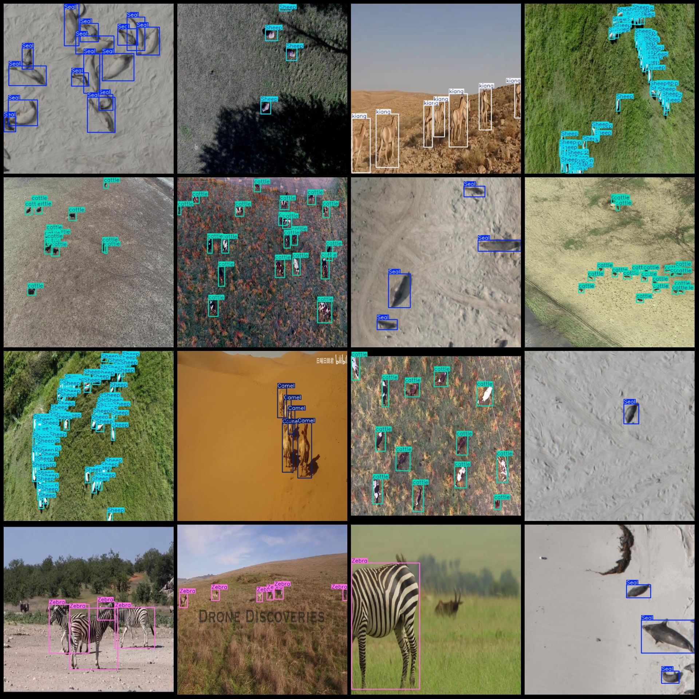
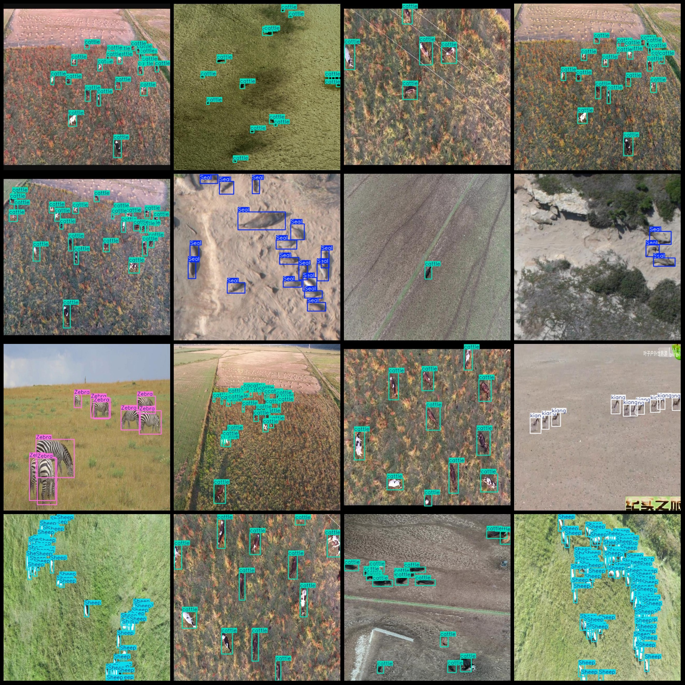

# Drone View Animals, Cattle, Camels, Sea Lions, Donkeys, and Deer Detection Dataset (VOC+YOLO Format) - 10,000 Images in 6 Categories

Data Format: Pascal VOC format + YOLO format (txt file without split path, only containing jpg images and corresponding VOC format xml files and yolov3 format txt files).
Number of Images (jpg file count): 10,000
Number of Annotations (xml file count): 10,000
Number of Annotations (txt file count): 10,000
Number of Annotation Categories: 6
Annotation Category Names (note that the order of categories in the yolo format does not match this, but rather refer to the "labels" folder's "classes.txt"): ["Camel", "Seal", "Sheep", "Zebra", 
"cattle", "kiang"]
Box Counts for Each Category:
Camel (camel) box count = 3295
Seal (sea lion) box count = 15620
Sheep (sheep) box count = 90689
Zebra (zebra) box count = 3792
cattle (cattle) box count = 44039
kiang (Tibetan wild ass) box count = 4636
Total Box Count: 162071
Image Resolution: 640x640
Drone: DJI MAVIC 3
Collection Height: 50-100m
Collection Angle: 90°
Used Annotation Tool: labelImg
Annotation Rules: Draw a square around the category
Special Notice: The dataset does not have been split into training, validation, or test sets; users need to manually split them.
Special Declaration: This dataset does not guarantee any accuracy of the trained models or weight files.
Image Preview:
Annotation Example:

## Images

Here is a pay link on Stripe ( https://buy.stripe.com/3cs8yP7sY87d0vu9AB ). Please contact me lonlonago@foxmail.com after funding $89, and I will send you a complete data files , thank you!

